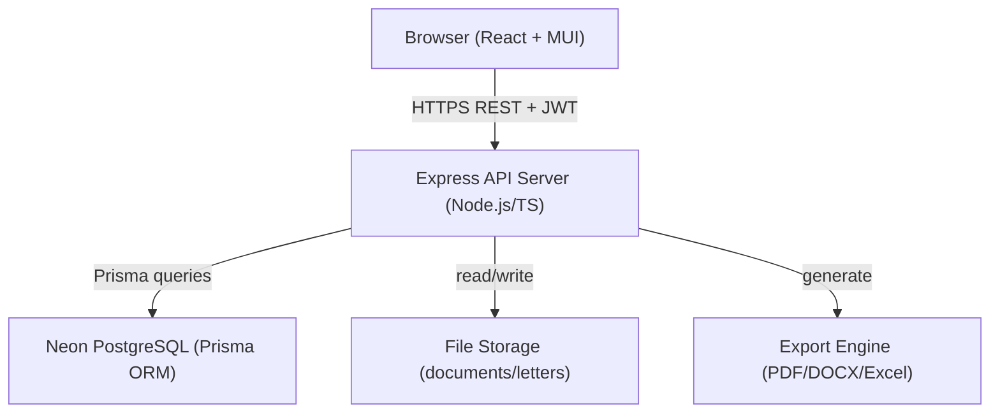
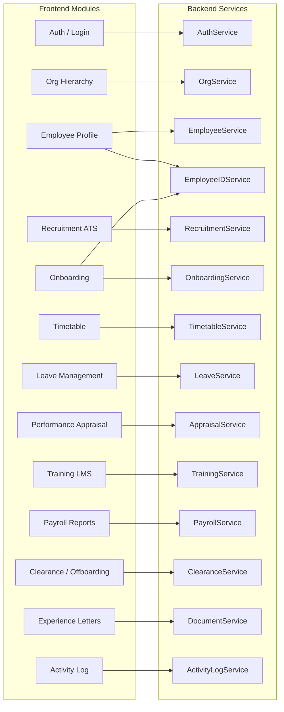
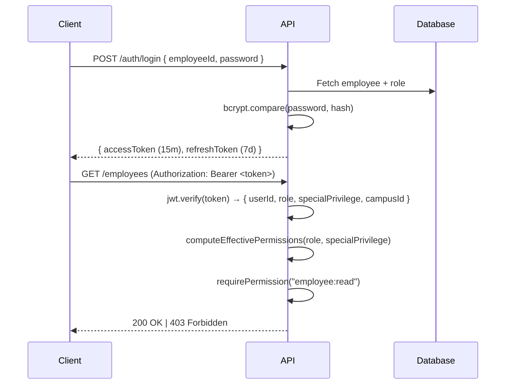
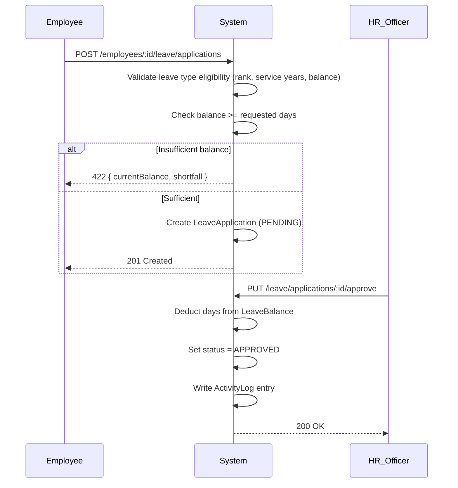
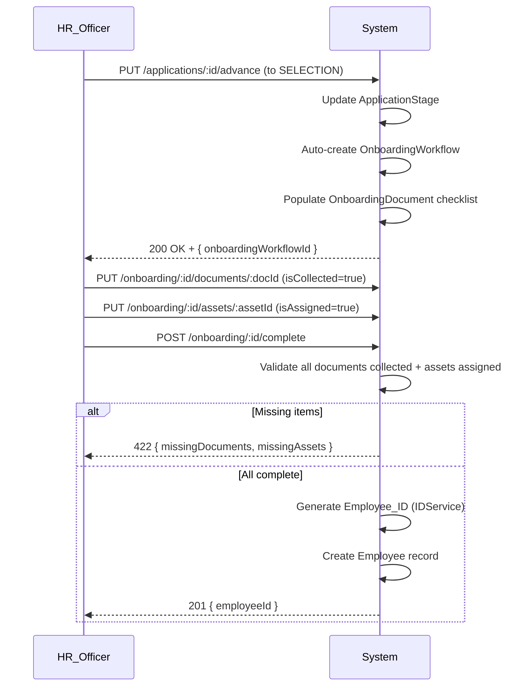

# Design Document: HRMS — Bahir Dar University

## Overview

The Bahir Dar University HRMS is a full-stack web application that manages the complete employee lifecycle across multiple campuses, colleges, departments, and units. It covers recruitment, onboarding, time management, leave, performance appraisal, training, payroll reporting, clearance/offboarding, and system-wide audit logging.

The system is structured as a monorepo with a React/TypeScript frontend (Vite + Material UI) and a Node.js/Express/TypeScript backend. The database is PostgreSQL hosted on Neon, accessed via Prisma ORM. Authentication uses JWT with an RBAC + Special Privilege permission model.

---

## Architecture

### Monorepo Structure

```
hrms-bdu/
├── apps/
│   ├── web/          # React + TypeScript + Vite frontend
│   └── api/          # Node.js + Express + TypeScript backend
├── packages/
│   └── shared/       # Shared TypeScript types, Zod schemas, constants
├── prisma/
│   └── schema.prisma # Single Prisma schema for all models
└── package.json      # Workspace root
```

### System Architecture Diagram



### Request Lifecycle

```
Client → JWT Middleware → RBAC Middleware → Route Handler → Service Layer → Prisma → DB
                                                                ↓
                                                        Activity Logger (async)
```

Every state-changing request passes through:
1. JWT verification (extracts `userId`, `role`, `specialPrivilege`)
2. RBAC middleware (computes effective permissions, rejects with 403 if insufficient)
3. Route handler delegates to a service
4. Service performs business logic and Prisma mutations
5. Activity logger writes an immutable `ActivityLog` entry asynchronously

---

## Components and Interfaces

### High-Level Module Diagram



---

## Data Models

All models are defined in a single Prisma schema. The following sections describe each model group.

### Organizational Hierarchy

```prisma
model Campus {
  id          String       @id @default(uuid())
  code        String       @unique  // immutable Campus_Code
  name        String
  createdAt   DateTime     @default(now())
  updatedAt   DateTime     @updatedAt
  colleges    College[]
  employees   Employee[]
  idCounters  EmployeeIDCounter[]
}

model College {
  id          String       @id @default(uuid())
  name        String
  campusId    String
  campus      Campus       @relation(fields: [campusId], references: [id])
  departments Department[]
}

model Department {
  id          String       @id @default(uuid())
  name        String
  collegeId   String
  college     College      @relation(fields: [collegeId], references: [id])
  units       Unit[]
  employees   Employee[]
}

model Unit {
  id           String     @id @default(uuid())
  name         String
  departmentId String
  department   Department @relation(fields: [departmentId], references: [id])
  employees    Employee[]
}
```

### Employee Profile

```prisma
enum Gender        { MALE FEMALE OTHER }
enum AcademicRank  { LECTURER ASSISTANT_PROFESSOR ASSOCIATE_PROFESSOR }
enum EmployeeStatus { ACTIVE INACTIVE PENDING }

model Employee {
  id                String          @id @default(uuid())
  employeeId        String          @unique  // e.g. BDU-2026-00001
  fullName          String
  dateOfBirth       DateTime
  gender            Gender
  nationality       String
  contactInfo       Json            // { phone, email, address }
  emergencyContact  Json            // { name, phone, relationship }
  academicRank      AcademicRank?
  status            EmployeeStatus  @default(PENDING)
  campusId          String
  campus            Campus          @relation(fields: [campusId], references: [id])
  departmentId      String?
  department        Department?     @relation(fields: [departmentId], references: [id])
  unitId            String?
  unit              Unit?           @relation(fields: [unitId], references: [id])
  hireDate          DateTime?
  endDate           DateTime?
  passwordHash      String
  isTempPassword    Boolean         @default(true)
  createdAt         DateTime        @default(now())
  updatedAt         DateTime        @updatedAt

  userRole          UserRole?
  documents         EmployeeDocument[]
  employmentHistory EmploymentHistory[]
  leaveBalances     LeaveBalance[]
  leaveApplications LeaveApplication[]
  evaluations       Evaluation[]
  trainingAssignments TrainingAssignment[]
  clearanceRecord   ClearanceRecord?
  experienceLetters ExperienceLetter[]
  activityLogs      ActivityLog[]
  scheduleEntries   ScheduleEntry[]
}

model EmployeeDocument {
  id           String   @id @default(uuid())
  employeeId   String
  employee     Employee @relation(fields: [employeeId], references: [id])
  documentType String   // "appointment_letter" | "contract" | other
  fileUrl      String
  uploadedAt   DateTime @default(now())
  uploadedBy   String   // Employee.id of the HR_Officer
}

model EmploymentHistory {
  id           String   @id @default(uuid())
  employeeId   String
  employee     Employee @relation(fields: [employeeId], references: [id])
  changeType   String   // "position" | "department" | "status"
  previousValue String?
  newValue     String
  changedBy    String   // Employee.id of acting user
  changedAt    DateTime @default(now())
}
```

### RBAC & Special Privileges

```prisma
enum BaseRole         { SUPER_ADMIN ADMIN HR_OFFICER EMPLOYEE }
enum SpecialPrivilege { UNIVERSITY_PRESIDENT VICE_PRESIDENT DEAN DIRECTOR }

model UserRole {
  id               String           @id @default(uuid())
  employeeId       String           @unique
  employee         Employee         @relation(fields: [employeeId], references: [id])
  baseRole         BaseRole
  specialPrivilege SpecialPrivilege?
  updatedAt        DateTime         @updatedAt
}

model Permission {
  id              String            @id @default(uuid())
  code            String            @unique  // e.g. "leave:approve"
  description     String
  rolePermissions RolePermission[]
  privilegePerms  PrivilegePermission[]
}

model RolePermission {
  id           String     @id @default(uuid())
  role         BaseRole
  permissionId String
  permission   Permission @relation(fields: [permissionId], references: [id])
  @@unique([role, permissionId])
}

model PrivilegePermission {
  id           String           @id @default(uuid())
  privilege    SpecialPrivilege
  permissionId String
  permission   Permission       @relation(fields: [permissionId], references: [id])
  @@unique([privilege, permissionId])
}
```

### Employee ID Sequence Counter

```prisma
model EmployeeIDCounter {
  id        String  @id @default(uuid())
  campusId  String
  campus    Campus  @relation(fields: [campusId], references: [id])
  year      Int
  sequence  Int     @default(0)
  @@unique([campusId, year])
}
```

### Recruitment (ATS)

```prisma
enum PostingType       { INTERNAL EXTERNAL }
enum RecruitmentStage  { SCREENING INTERVIEW SELECTION OFFER }

model JobPosting {
  id           String         @id @default(uuid())
  type         PostingType
  title        String
  description  String
  requirements String
  deadline     DateTime
  isAcademic   Boolean        @default(false)
  createdBy    String
  createdAt    DateTime       @default(now())
  applications Application[]
}

model Application {
  id                    String            @id @default(uuid())
  jobPostingId          String
  jobPosting            JobPosting        @relation(fields: [jobPostingId], references: [id])
  candidateName         String
  candidateEmail        String
  submittedAt           DateTime          @default(now())
  currentStage          RecruitmentStage  @default(SCREENING)
  publicationEvalScore  Float?
  stageHistory          ApplicationStage[]
}

model ApplicationStage {
  id            String           @id @default(uuid())
  applicationId String
  application   Application      @relation(fields: [applicationId], references: [id])
  stage         RecruitmentStage
  transitionedAt DateTime        @default(now())
  transitionedBy String
}
```

### Onboarding

```prisma
enum OnboardingStatus { PENDING IN_PROGRESS COMPLETED }

model OnboardingWorkflow {
  id            String            @id @default(uuid())
  applicationId String            @unique
  status        OnboardingStatus  @default(PENDING)
  createdAt     DateTime          @default(now())
  documents     OnboardingDocument[]
  assetAssignments AssetAssignment[]
}

model OnboardingDocument {
  id                  String             @id @default(uuid())
  onboardingWorkflowId String
  workflow            OnboardingWorkflow @relation(fields: [onboardingWorkflowId], references: [id])
  documentType        String
  isCollected         Boolean            @default(false)
  collectedAt         DateTime?
}

model AssetAssignment {
  id                  String             @id @default(uuid())
  onboardingWorkflowId String
  workflow            OnboardingWorkflow @relation(fields: [onboardingWorkflowId], references: [id])
  assetName           String
  assignedAt          DateTime?
  isAssigned          Boolean            @default(false)
}
```

### Timetable

```prisma
model ScheduleEntry {
  id           String    @id @default(uuid())
  employeeId   String
  employee     Employee  @relation(fields: [employeeId], references: [id])
  course       String
  dayOfWeek    Int       // 0=Sunday … 6=Saturday
  startTime    String    // "HH:MM"
  endTime      String    // "HH:MM"
  location     String
  createdAt    DateTime  @default(now())
  substitutions Substitution[]
}

model Substitution {
  id              String        @id @default(uuid())
  scheduleEntryId String
  scheduleEntry   ScheduleEntry @relation(fields: [scheduleEntryId], references: [id])
  substituteId    String
  sessionDate     DateTime
  loggedAt        DateTime      @default(now())
  loggedBy        String
}
```

### Leave Management

```prisma
enum LeaveTypeName {
  ANNUAL MATERNITY_PRENATAL MATERNITY_POSTNATAL PATERNITY
  SICK_FULL SICK_HALF PERSONAL SPECIAL LEAVE_WITHOUT_PAY
  STUDY RESEARCH SABBATICAL SEMINAR
}

enum LeaveStatus { PENDING APPROVED REJECTED }

model LeaveType {
  id           String        @id @default(uuid())
  name         LeaveTypeName @unique
  description  String
  maxDays      Int?
  payRate      Float         @default(1.0)  // 1.0 = full pay, 0.5 = half pay
  balances     LeaveBalance[]
  applications LeaveApplication[]
}

model LeaveBalance {
  id          String    @id @default(uuid())
  employeeId  String
  employee    Employee  @relation(fields: [employeeId], references: [id])
  leaveTypeId String
  leaveType   LeaveType @relation(fields: [leaveTypeId], references: [id])
  balance     Float     @default(0)
  year        Int
  @@unique([employeeId, leaveTypeId, year])
}

model LeaveApplication {
  id              String      @id @default(uuid())
  employeeId      String
  employee        Employee    @relation(fields: [employeeId], references: [id])
  leaveTypeId     String
  leaveType       LeaveType   @relation(fields: [leaveTypeId], references: [id])
  startDate       DateTime
  endDate         DateTime
  reason          String
  status          LeaveStatus @default(PENDING)
  rejectionReason String?
  approvedBy      String?
  approvedAt      DateTime?
  createdAt       DateTime    @default(now())
  supportingDocs  String[]    // file URLs (e.g. medical certificate)
}
```

### Performance Appraisal

```prisma
model Evaluation {
  id               String   @id @default(uuid())
  employeeId       String
  employee         Employee @relation(fields: [employeeId], references: [id])
  evaluationPeriod String   // e.g. "2025-Q1"
  efficiencyScore  Float
  workOutputScore  Float
  createdBy        String
  createdAt        DateTime @default(now())
  updatedAt        DateTime @updatedAt
}
```

### Training & LMS

```prisma
enum TrainingStatus { ASSIGNED IN_PROGRESS COMPLETED }

model TrainingProgram {
  id           String              @id @default(uuid())
  title        String
  description  String
  competencies String[]            // list of competency tags
  assignments  TrainingAssignment[]
}

model TrainingAssignment {
  id                String          @id @default(uuid())
  employeeId        String
  employee          Employee        @relation(fields: [employeeId], references: [id])
  trainingProgramId String
  trainingProgram   TrainingProgram @relation(fields: [trainingProgramId], references: [id])
  assignedDate      DateTime        @default(now())
  expectedCompletion DateTime
  completionDate    DateTime?
  status            TrainingStatus  @default(ASSIGNED)
}
```

### Payroll Reports

```prisma
enum PayrollExportFormat { EXCEL PDF DOCX }
enum ReportStatus        { DRAFT SENT VALIDATED }

model PayrollReport {
  id         String        @id @default(uuid())
  period     String        // e.g. "2025-06"
  generatedBy String
  generatedAt DateTime     @default(now())
  status     ReportStatus  @default(DRAFT)
  exports    PayrollExport[]
}

model PayrollExport {
  id             String             @id @default(uuid())
  payrollReportId String
  payrollReport  PayrollReport      @relation(fields: [payrollReportId], references: [id])
  format         PayrollExportFormat
  fileUrl        String
  exportedAt     DateTime           @default(now())
}
```

### Clearance & Offboarding

```prisma
enum ClearanceStatus   { IN_PROGRESS COMPLETED }
enum ApprovalMode      { SEQUENTIAL PARALLEL }
enum ClearanceTaskStatus { PENDING ACTIVE APPROVED REJECTED }

model ClearanceBody {
  id           String        @id @default(uuid())
  name         String        @unique  // e.g. "Library", "IT", "Finance"
  approvalMode ApprovalMode  @default(PARALLEL)
  order        Int           // used for sequential ordering
  tasks        ClearanceTask[]
}

model ClearanceRecord {
  id         String          @id @default(uuid())
  employeeId String          @unique
  employee   Employee        @relation(fields: [employeeId], references: [id])
  status     ClearanceStatus @default(IN_PROGRESS)
  initiatedAt DateTime       @default(now())
  completedAt DateTime?
  tasks      ClearanceTask[]
}

model ClearanceTask {
  id               String            @id @default(uuid())
  clearanceRecordId String
  clearanceRecord  ClearanceRecord   @relation(fields: [clearanceRecordId], references: [id])
  clearanceBodyId  String
  clearanceBody    ClearanceBody     @relation(fields: [clearanceBodyId], references: [id])
  status           ClearanceTaskStatus @default(PENDING)
  approvedBy       String?
  approvedAt       DateTime?
  rejectionReason  String?
  updatedAt        DateTime          @updatedAt
}
```

### Experience Letter

```prisma
enum LetterFormat { PDF DOCX }

model ExperienceLetter {
  id           String       @id @default(uuid())
  employeeId   String
  employee     Employee     @relation(fields: [employeeId], references: [id])
  generatedBy  String
  generatedAt  DateTime     @default(now())
  format       LetterFormat
  fileUrl      String
}
```

### Activity Log

```prisma
model ActivityLog {
  id             String   @id @default(uuid())
  actingUserId   String
  actingEmployee Employee @relation(fields: [actingUserId], references: [id])
  actingRole     String
  actionType     String   // e.g. "LEAVE_APPROVED", "EMPLOYEE_CREATED"
  resourceType   String   // e.g. "Employee", "LeaveApplication"
  resourceId     String
  previousState  Json?
  newState       Json?
  ipAddress      String
  timestamp      DateTime @default(now())

  // No update or delete operations are permitted on this model (enforced at service layer + DB trigger)
}
```

---

## API Endpoint Design

All endpoints are prefixed with `/api/v1`. Authentication is required on all routes unless noted. Responses follow `{ data, error, meta }` envelope.

### Auth

| Method | Path | Description |
|--------|------|-------------|
| POST | `/auth/login` | Authenticate, receive JWT |
| POST | `/auth/change-password` | Change temp/current password |
| POST | `/auth/logout` | Invalidate session |

### Organizational Hierarchy

| Method | Path | Description |
|--------|------|-------------|
| GET/POST | `/campuses` | List / create campuses |
| GET/PUT/DELETE | `/campuses/:id` | Get / update / delete campus |
| GET/POST | `/campuses/:id/colleges` | List / create colleges |
| GET/PUT/DELETE | `/colleges/:id` | Get / update / delete college |
| GET/POST | `/colleges/:id/departments` | List / create departments |
| GET/PUT/DELETE | `/departments/:id` | Get / update / delete department |
| GET/POST | `/departments/:id/units` | List / create units |
| GET/PUT/DELETE | `/units/:id` | Get / update / delete unit |

### Employees

| Method | Path | Description |
|--------|------|-------------|
| GET/POST | `/employees` | List / create employees |
| GET/PUT | `/employees/:id` | Get / update employee profile |
| POST | `/employees/:id/activate` | Activate employee (validates mandatory fields) |
| GET | `/employees/:id/documents` | List documents |
| POST | `/employees/:id/documents` | Upload document |
| GET | `/employees/:id/history` | Employment history |

### Roles & Permissions

| Method | Path | Description |
|--------|------|-------------|
| PUT | `/employees/:id/role` | Assign base role |
| PUT | `/employees/:id/privilege` | Assign / update special privilege |
| GET | `/employees/:id/permissions` | Get effective permissions |

### Recruitment

| Method | Path | Description |
|--------|------|-------------|
| GET/POST | `/job-postings` | List / create job postings |
| GET/PUT | `/job-postings/:id` | Get / update posting |
| GET/POST | `/job-postings/:id/applications` | List / submit applications |
| PUT | `/applications/:id/advance` | Advance to next stage |
| POST | `/applications/:id/offer` | Issue offer |

### Onboarding

| Method | Path | Description |
|--------|------|-------------|
| GET | `/onboarding/:workflowId` | Get onboarding workflow |
| PUT | `/onboarding/:workflowId/documents/:docId` | Mark document collected |
| PUT | `/onboarding/:workflowId/assets/:assetId` | Mark asset assigned |
| POST | `/onboarding/:workflowId/complete` | Complete onboarding, register employee |

### Timetable

| Method | Path | Description |
|--------|------|-------------|
| GET/POST | `/schedule` | List / create schedule entries |
| GET/PUT/DELETE | `/schedule/:id` | Get / update / delete entry |
| POST | `/schedule/:id/substitution` | Record substitution |
| GET | `/employees/:id/timetable` | View employee timetable (read-only) |

### Leave

| Method | Path | Description |
|--------|------|-------------|
| GET | `/leave/types` | List leave types |
| GET | `/employees/:id/leave/balances` | Get leave balances |
| GET/POST | `/employees/:id/leave/applications` | List / submit leave applications |
| PUT | `/leave/applications/:id/approve` | Approve leave |
| PUT | `/leave/applications/:id/reject` | Reject leave |

### Performance Appraisal

| Method | Path | Description |
|--------|------|-------------|
| GET/POST | `/employees/:id/evaluations` | List / create evaluations |
| GET/PUT | `/evaluations/:id` | Get / update evaluation |

### Training

| Method | Path | Description |
|--------|------|-------------|
| GET/POST | `/training/programs` | List / create training programs |
| POST | `/employees/:id/training` | Assign training |
| PUT | `/training/assignments/:id/complete` | Mark training complete |
| GET | `/employees/:id/skill-gap` | Get skill gap report |

### Payroll

| Method | Path | Description |
|--------|------|-------------|
| GET/POST | `/payroll/reports` | List / generate payroll reports |
| GET | `/payroll/reports/:id` | Get report |
| POST | `/payroll/reports/:id/export` | Export (Excel / PDF / DOCX) |
| PUT | `/payroll/reports/:id/validate` | Finance_Actor validates report |

### Clearance

| Method | Path | Description |
|--------|------|-------------|
| GET/POST | `/clearance/bodies` | List / configure clearance bodies |
| PUT | `/clearance/bodies/:id` | Update clearance body config |
| POST | `/employees/:id/clearance` | Initiate clearance |
| GET | `/employees/:id/clearance` | Get clearance record |
| PUT | `/clearance/tasks/:id/approve` | Approve clearance task |
| PUT | `/clearance/tasks/:id/reject` | Reject clearance task |

### Experience Letters

| Method | Path | Description |
|--------|------|-------------|
| POST | `/employees/:id/experience-letter` | Generate experience letter |
| GET | `/employees/:id/experience-letters` | List generated letters |

### Activity Log

| Method | Path | Description |
|--------|------|-------------|
| GET | `/activity-logs` | Query logs (filterable by user, action, resource, date, campus) |

---

## Authentication & Authorization

### JWT Flow



### Permission Computation

```typescript
// packages/shared/permissions.ts
function computeEffectivePermissions(
  role: BaseRole,
  privilege?: SpecialPrivilege
): Set<string> {
  const rolePerms = ROLE_PERMISSIONS[role] ?? new Set();
  const privPerms = privilege ? PRIVILEGE_PERMISSIONS[privilege] ?? new Set() : new Set();
  return new Set([...rolePerms, ...privPerms]);
}
```

### RBAC Middleware

```typescript
// apps/api/src/middleware/rbac.ts
export const requirePermission = (permission: string) =>
  (req: Request, res: Response, next: NextFunction) => {
    const { role, specialPrivilege } = req.user;
    const effective = computeEffectivePermissions(role, specialPrivilege);
    if (!effective.has(permission)) {
      return res.status(403).json({ error: "Forbidden" });
    }
    next();
  };
```

### First-Login Password Change Enforcement

Any request from a user with `isTempPassword = true` (except `POST /auth/change-password`) is rejected with HTTP 403 and `{ error: "PASSWORD_CHANGE_REQUIRED" }`.

---

## Key Workflows

### Clearance Workflow

```mermaid
sequenceDiagram
    participant E as Employee
    participant HR as HR_Officer
    participant SYS as System
    participant CB as ClearanceBody

    E->>HR: Submit resignation
    HR->>SYS: POST /employees/:id/clearance
    SYS->>SYS: Create ClearanceRecord (IN_PROGRESS)
    SYS->>SYS: Generate ClearanceTask for each ClearanceBody
    SYS->>SYS: Activate PARALLEL tasks immediately; activate first SEQUENTIAL task

    CB->>SYS: PUT /clearance/tasks/:id/approve
    SYS->>SYS: Record approver + timestamp
    SYS->>SYS: If SEQUENTIAL: activate next task
    SYS->>SYS: If all tasks APPROVED: set ClearanceRecord.status = COMPLETED
    SYS->>SYS: Trigger account deactivation (Employee.status = INACTIVE)
    SYS->>SYS: Revoke all active JWT sessions

    CB->>SYS: PUT /clearance/tasks/:id/reject
    SYS->>SYS: Record rejection reason
    SYS->>E: Notify employee of rejection
```

### Leave Approval Workflow



### Onboarding Trigger Workflow



---

## Correctness Properties

*A property is a characteristic or behavior that should hold true across all valid executions of a system — essentially, a formal statement about what the system should do. Properties serve as the bridge between human-readable specifications and machine-verifiable correctness guarantees.*

### Property Reflection

Before listing properties, redundant ones are eliminated:

- 1.6 (department has one campus) and 1.7 (unit has one department) are both hierarchy membership invariants — combined into Property 1.
- 3.4 (special privilege adds permissions) and 3.6 (effective = union) are the same property — kept as Property 4.
- 3.7 (403 on missing permission) and 3.8 (special privilege grants access) are both covered by the effective-permissions union property — kept as Property 5.
- 9.3 (balance insufficient → reject) is the contrapositive of 9.4 (approved → deduct) — combined into Property 10 (leave balance invariant).
- 9.21–9.22 (research leave eligibility) and 9.23–9.24 (sabbatical eligibility) are both eligibility-check properties — kept as separate Properties 12 and 13 since they have different criteria.
- 13.7 (clearance complete iff all tasks approved) subsumes 13.5 (sequential activation) — kept as Property 16 (clearance completion iff all approved).
- 16.1 (log entry for every action) and 16.2 (log entry has all fields) are combined into Property 17.
- 16.3 (immutability) and 16.6 (preserved after deactivation) are combined into Property 18.

---

### Property 1: Organizational Hierarchy Membership

*For any* Department record, it must be associated with exactly one College; and for any Unit record, it must be associated with exactly one Department. No orphaned organizational nodes may exist.

**Validates: Requirements 1.1, 1.6, 1.7**

---

### Property 2: Campus Code Immutability

*For any* Campus record and any update operation applied to it, the Campus_Code field must remain identical to its value at creation time.

**Validates: Requirements 1.2, 1.3**

---

### Property 3: Campus Deletion Blocked When Employees Exist

*For any* Campus that has one or more linked Employee records, a deletion request must be rejected with a descriptive error. Deletion must only succeed when no employees are linked.

**Validates: Requirements 1.4, 1.5**

---

### Property 4: Effective Permissions Are the Union of Role and Privilege

*For any* user with base role R and optional special privilege P, the user's effective permission set must equal `permissions(R) ∪ permissions(P)`. Assigning or updating a special privilege must never remove any permission already granted by the base role.

**Validates: Requirements 3.3, 3.4, 3.6**

---

### Property 5: Unauthorized Actions Return HTTP 403

*For any* permission-protected action requiring permission code C, and any user whose effective permission set does not contain C, the system must return HTTP 403 and deny the action.

**Validates: Requirements 3.7, 3.8**

---

### Property 6: Employee ID Uniqueness Per Campus Per Year

*For any* set of Employee records created under the same Campus in the same calendar year, all generated Employee_IDs must be distinct. The sequence component must be a zero-padded five-digit integer that increments by exactly 1 for each new employee, and resets to 00001 at the start of each new calendar year.

**Validates: Requirements 4.1, 4.2, 4.3, 4.4**

---

### Property 7: First-Login Password Change Enforcement

*For any* Employee whose `isTempPassword` flag is `true`, every API request except `POST /auth/change-password` must be rejected with HTTP 403 and error code `PASSWORD_CHANGE_REQUIRED`.

**Validates: Requirements 5.2**

---

### Property 8: Password Storage as Bcrypt Hash

*For any* password stored in the system, the stored value must be a valid bcrypt hash with a cost factor of at least 12 (i.e., the stored string must match the pattern `$2b$12$...`).

**Validates: Requirements 5.3**

---

### Property 9: Recruitment Stage Ordering

*For any* Application, stage transitions must strictly follow the order Screening → Interview → Selection → Offer. No application may skip a stage or transition backwards. For academic role applications, advancing past Screening without a `publicationEvalScore` must be rejected.

**Validates: Requirements 6.4, 6.5, 6.6**

---

### Property 10: Leave Balance Never Goes Negative

*For any* Employee and any leave type, the leave balance must never fall below zero. When a leave application is approved, the balance must decrease by exactly the approved duration. When a leave application is rejected or pending, the balance must remain unchanged.

**Validates: Requirements 9.2, 9.3, 9.4**

---

### Property 11: Annual Leave Entitlement Calculation

*For any* Employee with N years of service (N ≥ 1), the annual leave entitlement must equal `min(19 + N, 30)` working days. For Academic_Staff, leave applications outside the July–August summer recess period must require explicit HR_Officer or Admin approval.

**Validates: Requirements 9.8, 9.9**

---

### Property 12: Research Leave Eligibility Enforcement

*For any* Research_Leave application, the system must verify that the applicant holds the rank of Assistant Professor or above AND has at least 3 consecutive years of service. If either criterion is unmet, the application must be rejected with the specific unmet criteria listed.

**Validates: Requirements 9.21, 9.22**

---

### Property 13: Sabbatical Leave Eligibility Enforcement

*For any* Sabbatical_Leave application, the system must verify that the applicant is full-time Academic_Staff, holds the rank of Assistant Professor or above, AND has served continuously for at least 6 years. If any criterion is unmet, the application must be rejected with the specific unmet criteria listed.

**Validates: Requirements 9.23, 9.24, 9.25**

---

### Property 14: Sick Leave 8-Month Hard Cap

*For any* Employee, the total sick leave granted within any rolling 12-month period must not exceed 8 months. The first 6 months must be at full pay; months 7–8 must be at half pay. Any application that would cause the total to exceed 8 months must be rejected.

**Validates: Requirements 9.13, 9.14, 9.15**

---

### Property 15: Onboarding Completion Requires All Documents and Assets

*For any* OnboardingWorkflow, the `complete` action must be rejected if any `OnboardingDocument` has `isCollected = false` or any `AssetAssignment` has `isAssigned = false`. The rejection response must list all missing items.

**Validates: Requirements 7.3, 7.4**

---

### Property 16: Clearance Completion Iff All Tasks Approved

*For any* ClearanceRecord, the overall status must be set to `COMPLETED` if and only if every associated ClearanceTask has status `APPROVED`. For Sequential clearance bodies, a task must not become `ACTIVE` until all preceding tasks in the order are `APPROVED`.

**Validates: Requirements 13.3, 13.5, 13.7**

---

### Property 17: Activity Log Completeness

*For any* state-changing action performed by any user, an ActivityLog entry must be created containing all six required fields: `actingUserId`, `actingRole`, `actionType`, `resourceType`+`resourceId`, `previousState`/`newState`, `timestamp`, and `ipAddress`. No field may be null except `previousState` on creation actions.

**Validates: Requirements 16.1, 16.2**

---

### Property 18: Activity Log Immutability

*For any* ActivityLog entry, no update or delete operation must succeed — regardless of the requesting user's role, including Super_Admin. All ActivityLog entries associated with a deactivated Employee must remain fully retrievable after account deactivation.

**Validates: Requirements 16.3, 16.6**

---

### Property 19: Clearance Triggers Account Deactivation

*For any* Employee whose ClearanceRecord transitions to `COMPLETED`, the system must automatically set `Employee.status = INACTIVE` and revoke all active JWT sessions for that employee. All historical records (employment history, appraisals, training, payroll, activity logs) must remain accessible after deactivation.

**Validates: Requirements 15.1, 15.2, 15.3**

---

### Property 20: Employee Profile Activation Requires Complete Mandatory Fields

*For any* Employee profile activation attempt, the system must reject the activation if any mandatory field (fullName, dateOfBirth, gender, nationality, contactInfo, emergencyContact) is missing or null, and must return the list of missing fields.

**Validates: Requirements 2.5, 2.6**

---

## Error Handling

### HTTP Status Code Conventions

| Scenario | Status |
|----------|--------|
| Validation failure (missing fields, bad format) | 422 Unprocessable Entity |
| Authentication failure | 401 Unauthorized |
| Insufficient permissions | 403 Forbidden |
| Resource not found | 404 Not Found |
| Business rule violation (e.g. insufficient leave balance) | 422 with structured error body |
| Conflict (e.g. duplicate Campus_Code, schedule overlap) | 409 Conflict |
| Server error | 500 Internal Server Error |

### Error Response Envelope

```json
{
  "error": {
    "code": "INSUFFICIENT_LEAVE_BALANCE",
    "message": "Requested 10 days but only 3 days available.",
    "details": {
      "currentBalance": 3,
      "shortfall": 7
    }
  }
}
```

### Key Business Rule Errors

| Code | Trigger |
|------|---------|
| `CAMPUS_HAS_EMPLOYEES` | Campus deletion attempted with linked employees |
| `CAMPUS_CODE_IMMUTABLE` | Attempt to change Campus_Code on update |
| `CROSS_CAMPUS_UNIT` | Admin assigns employee to unit outside their campus |
| `INCOMPLETE_PROFILE` | Activation attempted with missing mandatory fields |
| `INSUFFICIENT_LEAVE_BALANCE` | Leave application exceeds available balance |
| `LEAVE_ELIGIBILITY_FAILED` | Sabbatical/research/study leave criteria not met |
| `SICK_LEAVE_CAP_EXCEEDED` | Sick leave would exceed 8-month annual cap |
| `SCHEDULE_CONFLICT` | New schedule entry overlaps existing instructor slot |
| `APPLICATION_AFTER_DEADLINE` | Job application submitted past deadline |
| `ACADEMIC_SCORE_REQUIRED` | Academic role application advancing without publication score |
| `ONBOARDING_INCOMPLETE` | Registration attempted with missing documents/assets |
| `CLEARANCE_NOT_COMPLETE` | Account deactivation attempted before clearance is done |
| `PASSWORD_CHANGE_REQUIRED` | First-login user accessing non-password-change endpoint |
| `ACTIVITY_LOG_IMMUTABLE` | Attempt to update or delete an activity log entry |

### Global Error Middleware

All unhandled errors are caught by a global Express error handler that:
1. Logs the error (server-side only, never exposed to client)
2. Returns a sanitized error response
3. Writes an ActivityLog entry for security-relevant errors (auth failures, 403s)

---

## Testing Strategy

### Dual Testing Approach

The testing strategy combines unit/example-based tests for specific behaviors with property-based tests for universal correctness guarantees.

### Property-Based Testing Library

**Library**: `fast-check` (TypeScript-native, works with Jest/Vitest)

Each property test runs a minimum of **100 iterations**. Each test is tagged with a comment referencing the design property:

```typescript
// Feature: hrms-bahir-dar-university, Property 6: Employee ID uniqueness per campus per year
it.prop([fc.string(), fc.integer({ min: 2020, max: 2030 }), fc.integer({ min: 1, max: 999 })])(
  'generates unique employee IDs',
  async (campusCode, year, count) => { ... }
);
```

### Property Tests (fast-check)

Each of the 20 correctness properties maps to one property-based test:

| Property | Test Description | Generator Strategy |
|----------|-----------------|-------------------|
| P1 | Hierarchy membership invariant | Generate random org trees, verify parent links |
| P2 | Campus code immutability | Generate campus + random update payload, verify code unchanged |
| P3 | Campus deletion blocked with employees | Generate campus with N≥1 employees, verify deletion rejected |
| P4 | Effective permissions = role ∪ privilege | Generate role/privilege pairs, verify union |
| P5 | 403 on missing permission | Generate actions + users lacking permission, verify 403 |
| P6 | Employee ID uniqueness | Generate N employee creations per campus/year, verify all IDs distinct |
| P7 | First-login enforcement | Generate requests from temp-password users, verify 403 except change-password |
| P8 | Bcrypt hash storage | Generate passwords, verify stored hash matches bcrypt pattern |
| P9 | Recruitment stage ordering | Generate stage transition sequences, verify only valid transitions accepted |
| P10 | Leave balance never negative | Generate approval sequences, verify balance ≥ 0 always |
| P11 | Annual leave entitlement | Generate years_of_service values, verify entitlement = min(19+N, 30) |
| P12 | Research leave eligibility | Generate applicants with varying rank/service, verify eligibility check |
| P13 | Sabbatical eligibility | Generate applicants with varying criteria, verify all three checked |
| P14 | Sick leave 8-month cap | Generate sick leave sequences, verify cap enforced |
| P15 | Onboarding completion gate | Generate partial onboarding states, verify completion rejected when incomplete |
| P16 | Clearance completion iff all approved | Generate clearance task approval sequences, verify status logic |
| P17 | Activity log completeness | Generate state-changing actions, verify log entry has all fields |
| P18 | Activity log immutability | Generate update/delete attempts on log entries, verify all rejected |
| P19 | Clearance triggers deactivation | Generate completed clearances, verify account deactivated + sessions revoked |
| P20 | Profile activation requires complete fields | Generate profiles with missing fields, verify activation rejected with field list |

### Unit / Example-Based Tests

Unit tests cover:
- Specific leave type calculations (maternity 30+90 days, paternity 10 days, sabbatical 1 year)
- Credential auto-generation on employee creation
- Onboarding workflow auto-trigger on Selection stage
- Experience letter field population from employee record
- Payroll report Excel and PDF/DOCX export format validity
- Finance_Actor report validation workflow
- Skill gap report computation (required competencies minus completed training)
- Activity log filtering by user, action type, resource type, date range, campus

### Integration Tests

Integration tests (using a test Neon database) cover:
- Full recruitment pipeline: post → apply → advance stages → offer
- Full onboarding pipeline: selection → workflow → document collection → employee registration
- Full clearance pipeline: initiation → task approvals (sequential + parallel) → account deactivation
- JWT authentication flow: login → access protected route → logout → verify token invalid
- Leave balance deduction end-to-end: apply → approve → verify balance updated in DB

### Test Configuration

```typescript
// vitest.config.ts
export default {
  test: {
    globals: true,
    environment: 'node',
    coverage: { provider: 'v8', threshold: { lines: 80 } }
  }
}
```

Run tests with:
```bash
npx vitest --run
```
